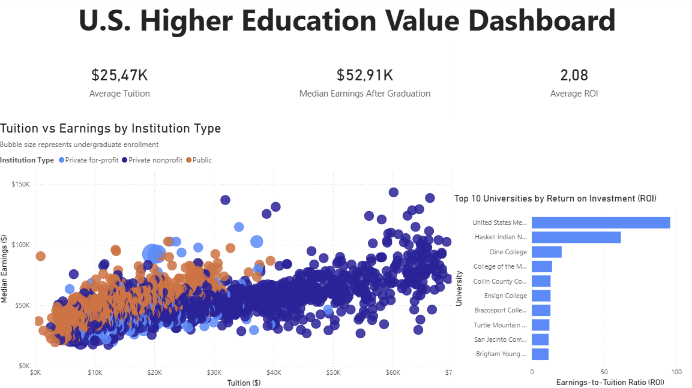

# University Analytics Project

Power BI analytics project exploring the relationship between
university tuition, graduate earnings, and return on investment (ROI)
using the U.S. Department of Education College Scorecard dataset.

---

## Dashboard Preview



---

## Key Insights

• Average tuition across institutions: **$25.47K**  
• Median graduate earnings: **$52.91K**  
• Average earnings-to-tuition ROI: **2.08**

The analysis reveals a positive relationship between tuition
costs and graduate earnings while highlighting institutions
with exceptionally strong return on investment.

---

## Dashboard Features

The Power BI dashboard includes:

• Executive KPI summary  
• Tuition vs earnings scatter plot  
• ROI comparison by institution type  
• Top universities by return on investment  

---

## Repository Structure

```
university_analytics_project/

├── data/
│   ├── gold_control_summary.csv
│   ├── gold_institution_roi.csv
│   ├── gold_locale_summary.csv
│   └── gold_state_summary.csv
│
├── notebooks/
│   ├── 01_data_cleaning.ipynb
│   └── 02_data_analysis.ipynb
│
├── dashboard/
│   ├── dashboard_preview.png
│   └── university_value_dashboard.pbix
│
├── README.md
└── LICENSE
```


---

## Gold Analytical Tables

The repository includes four **Gold-level analytical datasets** created during the data preparation stage.

| Dataset | Description |
|-------|-------------|
| gold_institution_roi | Institution-level metrics including tuition, graduate earnings, and ROI |
| gold_control_summary | Aggregated statistics by institution type (public, private nonprofit, for-profit) |
| gold_locale_summary | Aggregated statistics by geographic locale |
| gold_state_summary | Aggregated statistics by U.S. state |

These datasets serve as the primary data sources for the Power BI dashboard.

---

## Original Dataset

The full raw dataset used for this analysis is available from the U.S. Department of Education.

**College Scorecard Dataset**

https://collegescorecard.ed.gov/data/

The raw dataset is very large, so only the processed analytical tables are included in this repository.

---

## Tools Used

Python  
Pandas  
Jupyter Notebook  
Power BI  

---

## Author

Chris van Niekerk  

